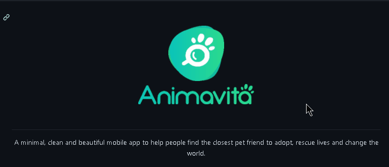

# Projeto com README 
Um projeto de teste com uma arquivo README 🚀

[](http://google.com)

## Tecnologias utilzadas
- HTML
- CSS
- JS

## Como ultilizar

1 - Clone o projeto 
```
git clone <url>

```

2 - Acesse a pasta do projeto
```
cd repositorio-como-readme
```
